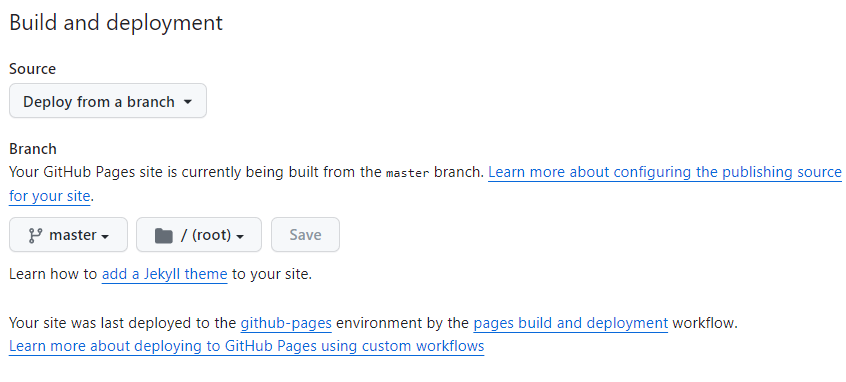

**Jekyll**是一个方便的静态博客生成工具，用户可以选择主题，并通过Jekyll将内容与选择的主题样式布局相结合，生成自己的静态博客网站。

## 环境安装

Ruby 安装：

官网地址：[https://rubyinstaller.org/downloads/](https://rubyinstaller.org/downloads/)

gihub地址：[https://github.com/oneclick/rubyinstaller2](https://github.com/oneclick/rubyinstaller2])

需要下载带开发版本的 `rubyinstaller-devkit-3.2.1-1-x64.exe`，自动安装

在命令行终端输入 `ruby -v` 检查 Ruby 是否安装成功，因为安装的是 Ruby+Devkit，因此 Gem 也会附带安装，输入 `gem -v` 查看 Gem 是否安装成功，两者均安装成功后就可以开始安装 Jekyll 了。输入

```
gem install jekyll bundler
```

来安装 Jekyll 和 Bundler gems。安装完成后，输入 `jekyll -v ` 和 `bundle -v` 查看 Jekyll 和 bundle gem 是否安装成功。

## 本地搭建博客

在计划存放博客的地方 `D:\blog` 打开命令行终端，输入以下命令构建新的 blog site，并在本地运行

```
jekyll new myblog
cd myblog
bundle add webrick
bundle exec jekyll serve
```

接下来就可以正常使用了，在浏览器中打开网址 `127.0.0.1:4000`，即可查看

## 如何使用主题

在 Github 找到一个自己喜欢的主题，我找的主题是：[https://github.com/mzlogin/mzlogin.github.io](https://github.com/mzlogin/mzlogin.github.io)，把它 fork 下来，命名为 `zhongliang924.github.io`。

在 branch 下选择 master：




访问 [https://zhongliang924.github.io/](https://zhongliang924.github.io/) 可以访问自己的开源博客了。

## Jekyll基本操作

清除数据：`jekyll clean`

在本地运行博客（以下三种命令作用相同）

```
bundle exec jekyll serve

jekyll serve

jekyll s
```
